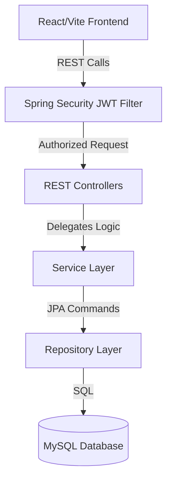

# 💰 Expense Tracker - Full-Stack App

Welcome to the **Expense Tracker**! 
This project is a beautifully designed, modern, full-stack web application designed for personal use. It focuses on streamlined management of financial records with a deep emphasis on UI/UX, responsive layouts, and robust backend architecture.

---

## 📖 Features

1. **Secure Access Protocol:** Full-stack JWT (JSON Web Token) based authentication securing individual user portals safely.
2. **Dynamic Dashboard:** A rich, mathematically-aggregated dashboard yielding real-time analytics for your Total Income, Total Expenses, and Net Balance.
3. **Data Visualization:** Built-in dynamic graphical representation (`recharts`) tracking sequential income vs expense volatility automatically.
4. **Intuitive Financial Logging:** An elegant dark-themed Records management portal for easily adding, classifying, styling, and deleting individual transactions.
5. **Robust RestAPI Backend:** A Spring Boot driven data hub handling strict model validations, custom repository queries, and layered architectural dependencies.

---

## 🏗️ Technology Stack

**Frontend:**
- React (Vite)
- Tailwind CSS (Deep Dark Styling: `#0f172a`, `#1f2937`)
- Recharts (Data Visualization)
- Lucide React (Icons)
- Axios (API Communication)

**Backend:**
- Java 23
- Spring Boot 3
- Spring Security (Stateless JWT Mechanism)
- Spring Data JPA
- MySQL

---

## 🚀 How to Run the Project on Your Computer

1. **Set up the Database:** 
   Ensure you have MySQL installed. Execute the following in your MySQL CLI (or tool like Workbench):
   ```sql
   CREATE DATABASE finance_project;
   ```
2. **Configure Database Credentials:**
   Open `Finance_Project_Backend\src\main\resources\application.properties` and replace the `root` username and password placeholder with your local MySQL credentials.
3. **Start the Backend:**
   Open a terminal into `Finance_Project_Backend` and launch:
   ```bash
   ./mvnw spring-boot:run
   ```
4. **Start the Frontend:**
   Open a fresh terminal into `Finance_Project_Frontend`, install the dependencies via `npm install`, and launch:
   ```bash
   npm run dev
   ```
5. **Access the Application:**
   Navigate to `localhost:5173` and create an account!

---

## 🗺️ Project Architecture Flowchart


